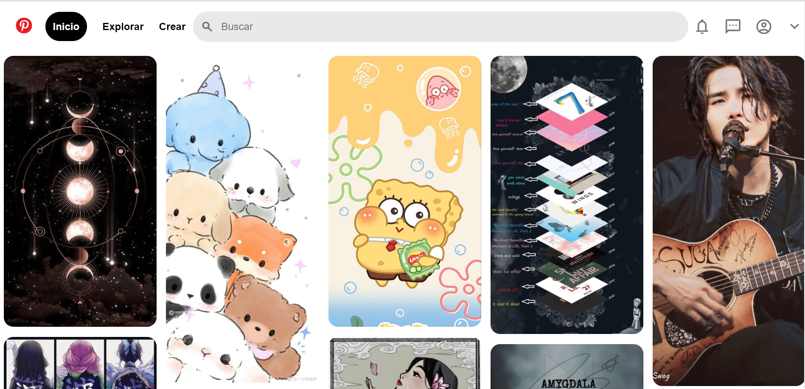

# Copia de pinterest con HTML5 y CSS3

Este proyecto es un [clon de la interfaz de inicio de Pinterest](https://iniciodepinterest-interfaz.vercel.app/), creado puramente con HTML5 y CSS3. Se enfoca en replicar la apariencia visual de pinterest, ofreciendo una experiencia de navegación similar con funcionalidades básicas.

### Características

- **Interfaz de Usuario Intuitiva:** Inspirada en [Pinterest](https://www.pinterest.es/), con una navegación fácil y accesible.
- **Interacciones Dinámicas:** Efectos visuales para elementos interactivos como botones y enlaces.
- **Iconografía y Estilos Modernos:** Uso de la biblioteca de Material Design y estilos CSS modernos para una apariencia cool.

### Tecnologías utilizadas
+ **HTML5:** Para la estructura básica del sitio.
+ **CSS3:** Para el diseño y estilo, incluyendos _flexbox_ para un diseño responsivos y efectos de _hover_.
+ **Google Icons:** Para iconos personalizados.

### Vista Previa del Proyecto

### Contacto

❀Vanessa Siordia: [Mi LinkedIn](https://www.linkedin.com/in/vanessa-siordia-alcocer-749a4624a/)

Este readme fue creado durante el bootcamp de [TecPRO](https://tecnolochicas.mx/)
